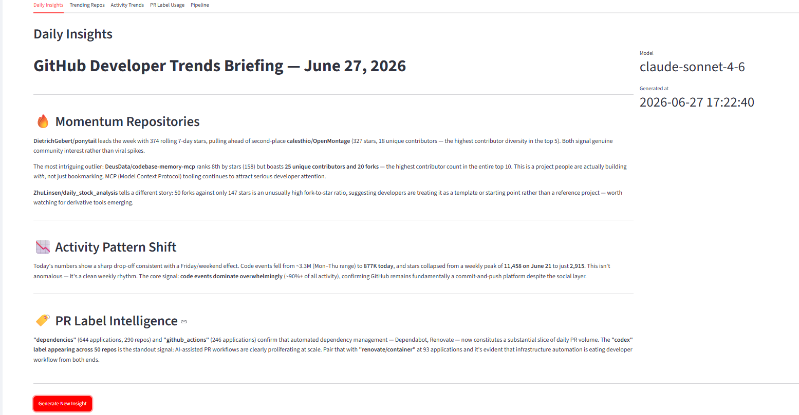
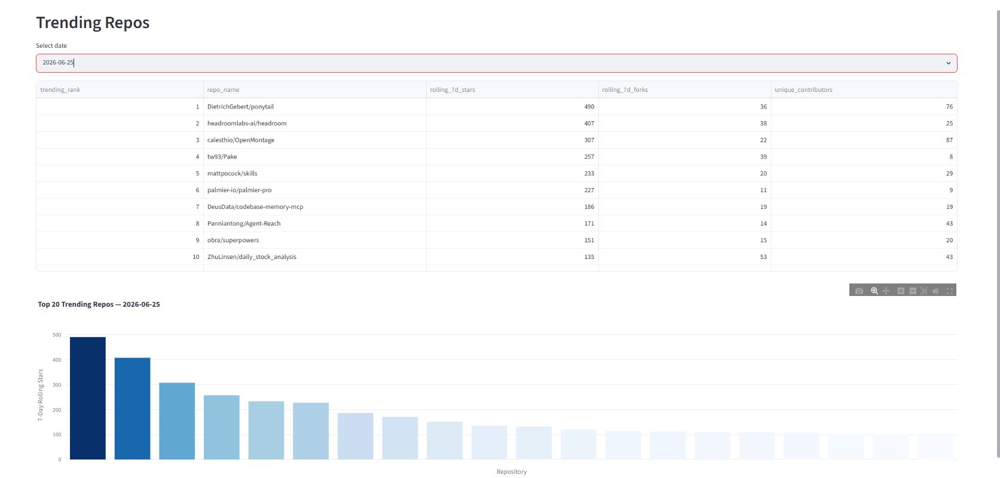
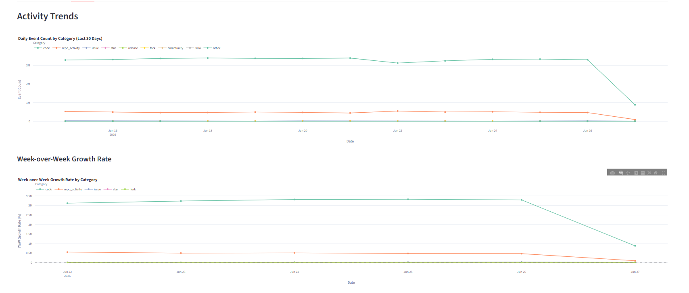
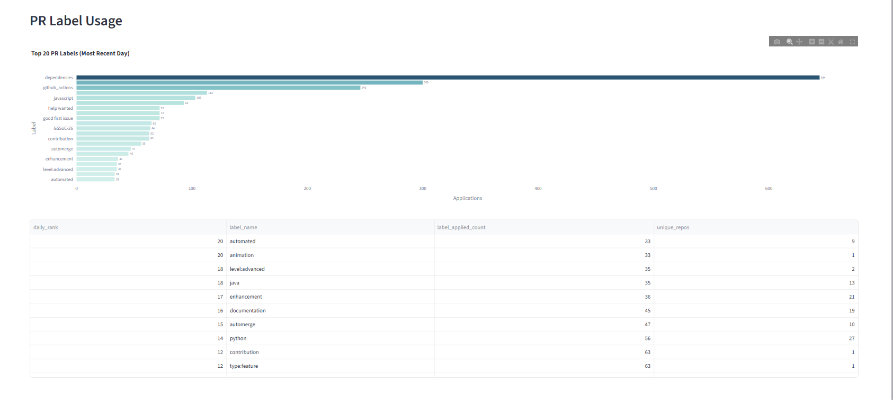
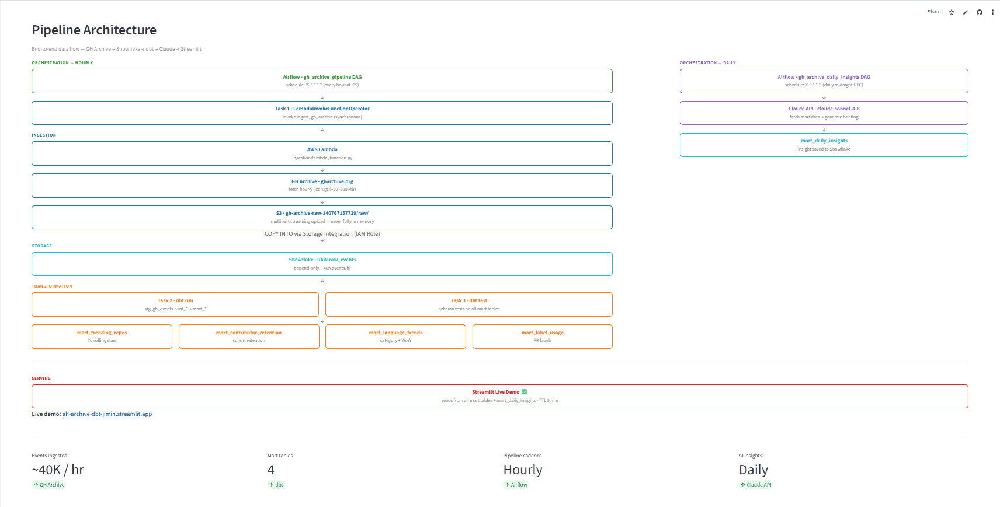
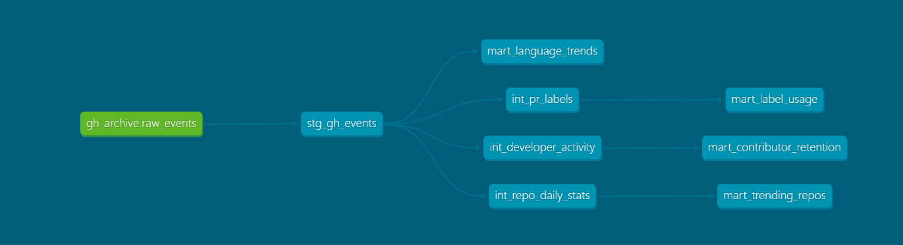

# gh-archive-dbt

A production dbt project that transforms hourly GitHub event data from [GH Archive](https://www.gharchive.org/) into trending repository rankings, contributor retention cohorts, and activity trend analysis, running on Snowflake.

---

## Live Demo

**[https://gh-archive-dbt-jimin.streamlit.app/](https://gh-archive-dbt-jimin.streamlit.app/)**

Interactive Streamlit dashboard with five tabs: Daily Insights (Claude-generated briefings), Trending Repos, Activity Trends, PR Label Usage, and a full Pipeline Architecture diagram.

| | |
|---|---|
|  |  |
|  |  |



---

## Project Overview

GH Archive records every public GitHub event — pushes, stars, forks, pull requests, issues, releases — at hourly granularity. This project ingests that raw firehose via AWS Lambda into Snowflake, deduplicates and lightly types it with dbt, then builds four analytical mart tables consumed by a Streamlit app and a Claude API insight generator.

**What it produces:**

| Mart | Description |
|------|-------------|
| `mart_trending_repos` | Top 100 repositories per day ranked by 7-day rolling star count |
| `mart_contributor_retention` | Monthly cohort retention matrix — how many first-time contributors return month over month |
| `mart_language_trends` | Daily event category breakdown with week-over-week growth rates |
| `mart_label_usage` | Daily top-20 PR labels by application count, surfacing labeling conventions across repos |

---

## Architecture

```
                        ┌─────────────────────────────────────────────────────────┐
                        │                    Orchestration                        │
                        │         Airflow (Docker Compose, hourly DAG)            │
                        └──────────────────────┬──────────────────────────────────┘
                                               │
 ┌────────────────┐    ┌──────────────┐    ┌──┴───────┐    ┌───────┐    ┌─────────────────┐
 │   GH Archive   │───▶│ AWS Lambda   │───▶│    S3    │───▶│ Snow- │───▶│      dbt        │
 │ gharchive.org  │    │ (Task 1 via  │    │   raw    │    │ flake │    │  (this project) │
 │ ~40k events/hr │    │  Airflow)    │    │          │    │  RAW  │    │                 │
 └────────────────┘    └──────────────┘    └──────────┘    └───────┘    └────────┬────────┘
                                                                                  │
                              ┌───────────────────────────────────────────────────┤
                              │                                                   │
                     ┌────────┴────────┐                               ┌──────────┴────────┐
                     │   Claude API    │                               │    Streamlit      │
                     │ (daily midnight │                               │  (dashboards)     │
                     │  insight gen.)  │                               │                   │
                     └─────────────────┘                               └───────────────────┘
```

**End-to-end data flow:**

```
GH Archive (gharchive.org)
    ↓ hourly — Airflow (gh_archive_pipeline DAG) invokes Lambda directly
AWS Lambda + S3
    ↓ COPY INTO
Snowflake RAW.raw_events
    ↓ Airflow: dbt run + dbt test every hour
stg_gh_events              (incremental, deduped, 3hr lookback)
    ├── int_repo_daily_stats      (ephemeral CTE)
    │       └── mart_trending_repos        (table)
    ├── int_developer_activity    (ephemeral CTE)
    │       └── mart_contributor_retention  (table)
    ├── mart_language_trends               (table)
    └── int_pr_labels             (ephemeral CTE)
            └── mart_label_usage           (table)
    ↓ Airflow: daily midnight DAG
Claude API → mart_daily_insights
    ↓
Streamlit Live Demo  https://gh-archive-dbt-jimin.streamlit.app/
```

---

## Project Structure

```
gh_archive/
├── dbt_project.yml                         # Project config and materialization defaults
├── packages.yml                            # dbt_utils 1.3.0 dependency
├── package-lock.yml                        # Pinned package hash
├── profiles.yml.template                   # Safe-to-commit credential template (no secrets)
├── streamlit_app.py                        # Streamlit dashboard (5 tabs)
├── requirements.txt                        # Python deps for Streamlit + insights
│
├── ingestion/                              # Lambda ingestion pipeline
│   ├── lambda_function.py                  # GH Archive → S3 → Snowflake COPY INTO
│   ├── Dockerfile                          # Lambda container image
│   ├── requirements.txt                    # requests, snowflake-connector-python
│   └── backfill.py                         # Manual backfill utility for historical data
│
├── airflow/                                # Airflow orchestration
│   ├── docker-compose.yml                  # Airflow + PostgreSQL
│   ├── Dockerfile.airflow                  # Custom image with dbt-snowflake + providers
│   ├── .env.example                        # AIRFLOW_UID, AWS_ACCESS_KEY_ID, AWS_SECRET_ACCESS_KEY,
│   │                                       # AWS_DEFAULT_REGION, SNOWFLAKE_ACCOUNT, SNOWFLAKE_USER,
│   │                                       # SNOWFLAKE_PASSWORD, ANTHROPIC_API_KEY
│   └── dags/
│       ├── gh_archive_pipeline.py          # Hourly: Lambda → dbt run → dbt test
│       └── gh_archive_daily_insights.py    # Daily midnight: Claude API insights
│
├── insights/
│   └── insights_generator.py              # Fetch mart data → Claude API → mart_daily_insights
│
├── macros/
│   ├── get_event_category.sql              # Maps 16 raw event types to 8 semantic categories
│   └── safe_divide.sql                     # NULL-safe division (avoids divide-by-zero)
│
├── models/
│   ├── staging/
│   │   └── gh_archive/
│   │       ├── sources.yml                 # Source definition with freshness SLAs
│   │       ├── schema.yml                  # stg_gh_events column tests and docs
│   │       └── stg_gh_events.sql           # Incremental dedup of raw GitHub events
│   │
│   ├── intermediate/
│   │   ├── schema.yml                      # Column tests and docs for all int_ models
│   │   ├── int_repo_daily_stats.sql        # Daily star/fork/code/issue counts per repo
│   │   ├── int_developer_activity.sql      # Daily event counts and code ratio per actor
│   │   └── int_pr_labels.sql              # PullRequestEvent labels exploded via LATERAL FLATTEN
│   │
│   └── marts/
│       ├── schema.yml                      # Column tests and docs for all four marts
│       ├── mart_trending_repos.sql         # Top-100 repos by 7-day rolling stars
│       ├── mart_contributor_retention.sql  # Monthly cohort retention matrix
│       ├── mart_language_trends.sql        # Daily category breakdown with WoW growth
│       └── mart_label_usage.sql            # Daily top-20 PR labels by application count
│
├── tests/                                  # Custom singular tests (empty, uses schema tests)
├── seeds/                                  # Static reference data (none yet)
├── snapshots/                              # SCD snapshots (none yet)
├── analyses/                               # Ad-hoc analytical queries (none yet)
│
└── docs/
    └── lineage_graph.png                   # dbt lineage screenshot (see Lineage Graph below)
```

---

## Key Technical Decisions

### (a) Incremental materialization on `stg_gh_events`

GH Archive emits roughly 40,000 events per hour. Running a full refresh every hour would re-scan the entire `RAW.raw_events` table each time, which is expensive at scale. Instead, `stg_gh_events` is materialized as `incremental`:

- **3-hour lookback window** — the `WHERE` filter re-processes the last 3 hours rather than trusting `MAX(created_at)` exactly. GH Archive occasionally delivers events a few hours late; the overlap catches them without needing a full rescan.
- **`unique_key = 'event_id'`** — Snowflake executes the incremental run as a `MERGE` on `event_id`. Any event that re-appears in the overlap window is updated in place rather than duplicated, making the load idempotent.
- **`on_schema_change = 'sync_all_columns'`** — new columns added to `raw_events` automatically propagate into the staging model without a manual full refresh.

The folder-level default in `dbt_project.yml` sets staging to `view`, but the `{{ config(...) }}` block inside `stg_gh_events.sql` overrides it for this one model. In-file config always takes precedence over directory-level defaults.

### (b) Ephemeral materialization for intermediate models

`int_repo_daily_stats` and `int_developer_activity` are never queried by analysts or BI tools directly — they exist solely to feed the mart models. Materializing them as views or tables would create Snowflake objects that only exist for internal wiring.

`ephemeral` models are compiled into CTEs and inlined directly into the SQL of any model that `ref()`s them. The result is that each mart model executes as a single, self-contained query with no intermediate Snowflake objects. This keeps the schema clean and avoids paying for storage or compute on intermediate results that no one queries directly.

### (c) Macros for event categorization

GH Archive has 20+ distinct event types (`PushEvent`, `PullRequestEvent`, `PullRequestReviewEvent`, `IssueCommentEvent`, etc.) that need to be mapped to a smaller set of semantic categories (`code`, `issue`, `star`, `fork`, `release`, `repo_activity`, `community`, `wiki`).

Without a macro, this `CASE` expression would be copy-pasted into every model that needs it (`int_repo_daily_stats`, `int_developer_activity`, `mart_language_trends`). The `get_event_category()` macro provides a single source of truth: adding a new event type or changing a category mapping is a one-line edit in one file, with the change automatically propagated everywhere the macro is called at compile time.

`safe_divide()` follows the same principle — wrapping the NULL-guard pattern once so callers write `{{ safe_divide('a', 'b') }}` instead of repeating the `CASE WHEN denominator = 0 OR denominator IS NULL THEN NULL ELSE ...` pattern.

### (d) Surrogate key / GROUP BY column mismatch bug

**Problem discovered:** `int_repo_daily_stats` and `int_developer_activity` both generate a surrogate key via `dbt_utils.generate_surrogate_key()` but the hash inputs and the `GROUP BY` columns were out of sync:

```sql
-- surrogate_key hashed only repo_id + date_day ...
generate_surrogate_key(['repo_id', 'date_day']) as surrogate_key

-- ... but GROUP BY included repo_name as well
GROUP BY repo_id, repo_name, date_day
```

`repo_name` (and `actor_login` in the developer model) are mutable on GitHub — a repository can be renamed and a user can change their username. When that happens, the same `repo_id` appears in the same day's data with two different `repo_name` values. Because `GROUP BY` treated them as distinct groups, they produced two rows with identical `surrogate_key` values, failing the `unique` schema test. This surfaced as 32 duplicate-key failures on `unique_int_repo_daily_stats_surrogate_key` and 4 on `unique_int_developer_activity_surrogate_key`.

**Root cause:** The surrogate key was designed to represent *one entity per day*, but the `GROUP BY` inadvertently encoded an attribute (`repo_name` / `actor_login`) that can vary intra-day for the same entity — creating a fan-out that broke the uniqueness guarantee.

**Fix:** Narrow `GROUP BY` to match exactly what the surrogate key hashes (`repo_id + date_day` / `actor_id + date_day`), and resolve the multi-value attribute conflict with `MAX_BY()`:

```sql
-- int_repo_daily_stats (same pattern in int_developer_activity)
GROUP BY repo_id, date_day

-- take the name as of the most recent event on that day
MAX_BY(repo_name, created_at) as repo_name
```

`MAX_BY(column, ordering_column)` picks the value associated with the latest `created_at` timestamp in the group, making the chosen name deterministic and reflecting the entity's most up-to-date state for that day. Both unique tests now pass.

**Known data quality issue (tracked, not suppressed):** `int_repo_daily_stats.repo_id` has a single `not_null` violation caused by GH Archive omitting `repo` metadata on some `ForkEvent` payloads — an upstream defect outside our control. Rather than silently dropping the row, the `not_null` test is set to `severity: warn` in `schema.yml` so it surfaces in CI output as a tracked known issue without blocking the run.

---

## Lineage Graph



To generate and capture your own lineage graph:

```bash
dbt docs generate
dbt docs serve
# Open http://localhost:8080, navigate to the lineage graph, screenshot it to docs/lineage_graph.png
```

---

## Tech Stack

| Component | Version / Status |
|-----------|-----------------|
| Snowflake | Warehouse (GH_ARCHIVE database) |
| dbt-core | 1.11.11 |
| dbt-snowflake | 1.11.5 |
| dbt_utils | 1.3.0 |
| AWS Lambda | Invoked hourly by Airflow `LambdaInvokeFunctionOperator` (`ingestion/lambda_function.py`) |
| AWS EventBridge | Rule exists but disabled — Airflow is the trigger |
| S3 | Raw event staging area |
| Airflow | Pipeline orchestration via Docker Compose (`airflow/`) |
| Claude API | Daily trend insights at midnight (`insights/insights_generator.py`) |
| Streamlit | Interactive analytics app — [live demo](https://gh-archive-dbt-jimin.streamlit.app/) |

---

## Ingestion Pipeline

Airflow's `gh_archive_pipeline` DAG (`schedule: "5 * * * *"`, offset by 5 minutes to let GH Archive publish) is the top-level orchestrator. It invokes `ingestion/lambda_function.py` directly via `LambdaInvokeFunctionOperator` as Task 1. An AWS EventBridge rule exists on the Lambda but is disabled — Airflow is the sole trigger. Lambda streams the GH Archive `.json.gz` file for that hour — typically 50–500 MB — directly to S3 using multipart upload, so the full file is never loaded into memory. Snowflake then loads from S3 via a Storage Integration backed by an IAM Role trust policy; no static AWS credentials are stored in Snowflake.

Airflow orchestrates the full hourly sequence:

```
gh_archive_pipeline (hourly)
├── Task 1: LambdaInvokeFunctionOperator  →  invoke ingest_gh_archive (synchronous)
├── Task 2: BashOperator  →  dbt run --select stg_gh_events+
└── Task 3: BashOperator  →  dbt test --select stg_gh_events+
```

A separate daily DAG (`gh_archive_daily_insights`, `schedule: "0 0 * * *"`) runs at midnight UTC. It calls the Claude API with the latest mart data and writes the generated briefing to `mart_daily_insights`.

---

## Backfill

To load historical GH Archive data, edit `start_date` and `end_date` at the top of `ingestion/backfill.py`, then run:

```bash
python ingestion/backfill.py
```

The script iterates hour by hour and invokes Lambda synchronously (`InvocationType=RequestResponse`), waiting for each hour to complete before moving to the next. This keeps memory flat and makes failures easy to spot.

The load is idempotent: Snowflake's `COPY INTO` runs with `FORCE = FALSE`, so any S3 file already present in the load history (tracked for 180 days) is silently skipped. After the backfill finishes, propagate the historical data through all mart models:

```bash
dbt run --select stg_gh_events+
```

---

## How to Run

**Prerequisites:** Python environment with `dbt-snowflake` installed, and `~/.dbt/profiles.yml` configured from `profiles.yml.template`.

```bash
# 1. Install dbt package dependencies
dbt deps

# 2. Run all models (staging → intermediate → marts)
dbt run

# 3. Run the full staging model as a full refresh (first run or schema reset)
dbt run --full-refresh --select stg_gh_events

# 4. Run tests defined in schema.yml files
dbt test

# 5. Generate and serve documentation with the lineage graph
dbt docs generate
dbt docs serve

# 6. Check source freshness (will warn if raw_events > 2h stale, error if > 6h)
dbt source freshness
```

**Run a single layer:**

```bash
dbt run --select staging
dbt run --select marts
dbt run --select mart_trending_repos
```

---

## Streamlit (dashboards)

An interactive analytics app that visualises all four mart tables and lets you trigger Claude-powered daily insights from the browser.

**Prerequisites:** Copy `.env.example` to `.env` and fill in your Snowflake credentials.

```bash
# Install Python dependencies
pip install -r requirements.txt

# Launch the app
streamlit run streamlit_app.py
```

The app opens at `http://localhost:8501` and provides five tabs:

| Tab | Contents |
|-----|----------|
| **Daily Insights** | Latest AI-generated trend briefing from `mart_daily_insights`; "Generate New Insight" button calls Claude via `insights/insights_generator.py` |
| **Trending Repos** | Date-picker → top-20 repos from `mart_trending_repos` as a table + bar chart (7-day rolling stars) |
| **Activity Trends** | Last-30-day event count & week-over-week growth rate line charts from `mart_language_trends` |
| **PR Label Usage** | Top-20 PR labels from `mart_label_usage` as a horizontal bar chart |
| **Pipeline** | End-to-end architecture diagram showing the full data flow |

All Snowflake queries are cached for 300 seconds via `st.cache_data`. The sidebar shows the timestamp of the most recent event in `stg_gh_events`.

